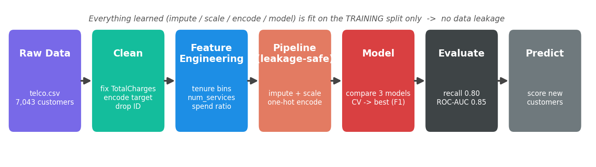
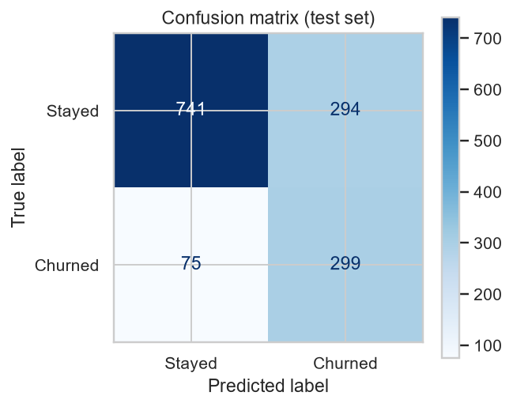
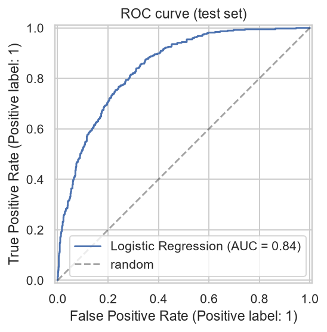
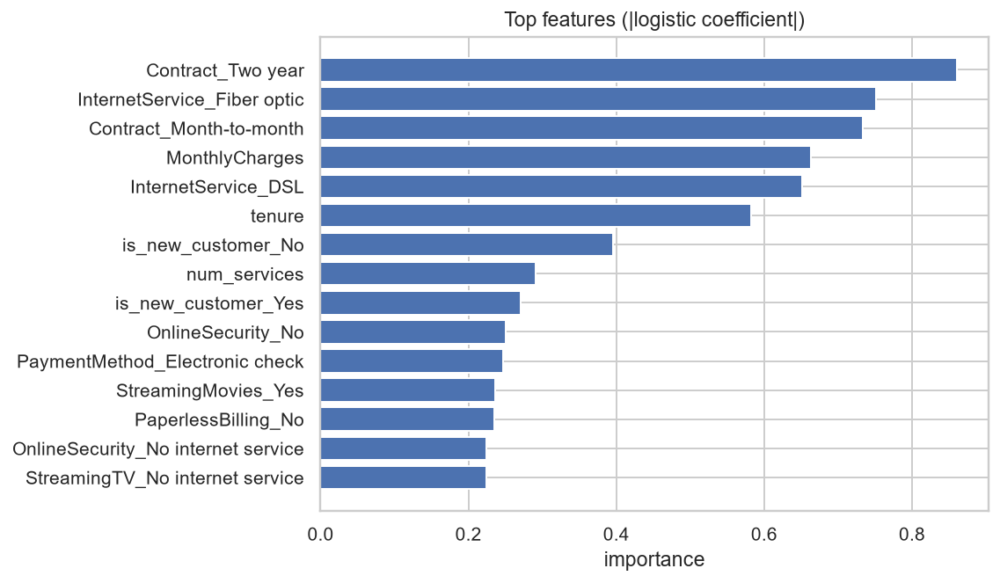
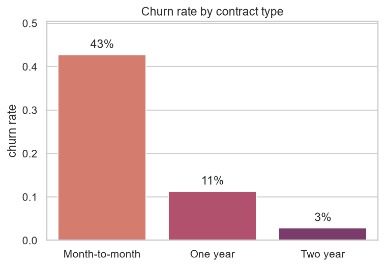

# Telco Customer Churn Prediction


An end-to-end machine-learning project that predicts which telecom customers are
likely to **churn** (cancel their service), so the business can target them with
retention offers before they leave. Built as a clean, reproducible, leakage-safe
scikit-learn pipeline: **data cleaning → EDA → feature engineering → model
comparison → evaluation → inference.**

---

## What this project does 

A phone/internet company loses money whenever a customer cancels, and keeping an
existing customer is cheaper than winning a new one. This project looks at a
customer's details — how long they've been with the company, their monthly bill,
their contract type, the services they use — and **predicts whether they are
likely to cancel**, along with a probability (e.g. *"93% likely to leave"*). The
model learned this pattern from 7,000 real customers whose outcomes are already
known, and it correctly identifies about **80% of customers who go on to churn.**

> **Note:** Personal/academic project built for learning. Every number below comes
> from actually running the pipeline on the public Telco dataset — nothing is
> invented. Re-running `python main.py` reproduces the results exactly (fixed seed).

<p align="center">
  
</p>

---

## Results (held-out test set, 1,409 unseen customers)

| Metric | Score | What it means |
|---|---|---|
| **ROC-AUC** | **0.845** | Ranks a random churner above a random non-churner 85% of the time |
| **Recall (churn)** | **0.80** | Catches 80% of the customers who actually churn |
| Precision (churn) | 0.50 | Half of the customers it flags really do churn |
| F1 (churn) | 0.62 | Balance of precision and recall |
| Accuracy | 0.74 | Reported, but *not* the target metric — the data is imbalanced |

**Model selected: Logistic Regression (class-weighted).** It beat Random Forest
and Gradient Boosting on cross-validated **F1** and gave by far the best
**recall** — the priority for churn, where missing an at-risk customer costs more
than a false alarm. It's also interpretable, so we can explain *why* a customer
is flagged.

<p align="center">
  
  
</p>

### Why precision is 0.50 but recall is 0.80 (a deliberate trade-off)
For churn, a **missed leaver** (false negative) is far more expensive than a
**false alarm** (false positive — offering a discount to someone who'd have
stayed anyway). So the model is intentionally tuned to catch as many real
leavers as possible, accepting some false alarms. That's the right call for the
business problem, not a weakness.

---

## What drives churn (from the model)

The strongest predictors line up with intuition: customers on **month-to-month
contracts** and **new customers** (short tenure) churn the most, while those on
**two-year contracts** rarely leave. Higher monthly charges and fiber-optic
internet also push churn up.

<p align="center">
  
</p>

A clear example from the data — churn rate collapses as contract length grows:

<p align="center">
  
</p>

---

## Dataset

- **Source:** IBM Telco Customer Churn (public), ~7,043 customers, 21 columns.
- **Target:** `Churn` (Yes/No) — imbalanced at **~27% churn**.
- **Features:** demographics (gender, senior citizen, partner, dependents),
  account info (tenure, contract, payment method, charges), and subscribed
  services (phone, internet, streaming, security, etc.).

The CSV is included at `data/raw/telco.csv`.

---

## Quickstart

```bash
# 1. create and activate a virtual environment
python -m venv venv
venv\Scripts\activate          # Windows
# source venv/bin/activate     # macOS / Linux

# 2. install dependencies
pip install -r requirements.txt

# 3. run the whole pipeline end to end
python main.py
```

Running `main.py` writes:
- `data/processed/telco_clean.parquet` — cleaned, typed data
- `reports/figures/*.png` — EDA + evaluation charts
- `reports/metrics.json` — all metrics
- `models/churn_pipeline.joblib` — the fitted pipeline, ready to reuse

Score a new customer:

```bash
python -m src.predict
```

---

## Project structure

```
churn-prediction/
├── main.py                 # runs the full pipeline end to end
├── requirements.txt
├── data/
│   ├── raw/telco.csv       # original dataset
│   └── processed/          # cleaned parquet (generated)
├── models/                 # saved pipeline (generated)
├── reports/
│   ├── figures/            # all charts (generated)
│   └── metrics.json        # metrics (generated)
└── src/
    ├── config.py           # paths + constants (one source of truth)
    ├── data.py             # load + clean (fix TotalCharges, encode target)
    ├── features.py         # feature engineering + leakage-safe preprocessor
    ├── eda.py              # exploratory analysis + figures
    ├── train.py            # build pipeline, compare models via CV, save best
    ├── evaluate.py         # test metrics + confusion matrix / ROC / importances
    └── predict.py          # load pipeline, score new customers
```

---

## How it works (the pipeline)

1. **Clean** (`data.py`) — `TotalCharges` is stored as text with 11 blanks (all
   brand-new customers with tenure 0 → filled with 0); the target is encoded
   Yes/No → 1/0; `customerID` is dropped.
2. **Engineer features** (`features.py`) — deterministic, target-free columns:
   - `tenure_group` — binned loyalty bands
   - `num_services` — count of subscribed services (an aggregation)
   - `avg_charges_per_mo` — a ratio (TotalCharges ÷ tenure)
   - `is_new_customer` — tenure ≤ 6 months, where churn is concentrated
3. **Preprocess inside a Pipeline** — a `ColumnTransformer` median-imputes and
   scales numeric columns, and most-frequent-imputes and one-hot encodes
   categorical columns. Everything is fit on the **training split only → no data
   leakage.**
4. **Compare models** (`train.py`) — Logistic Regression, Random Forest, and
   Gradient Boosting, each cross-validated (5-fold, stratified) on ROC-AUC / F1 /
   recall. The best-by-F1 model is refit and saved.
5. **Evaluate** (`evaluate.py`) — precision / recall / F1 / ROC-AUC on the
   held-out test set, plus a confusion matrix, ROC curve, and feature importances.
6. **Predict** (`predict.py`) — load the single saved pipeline object and score
   new customers.

---


## Author

**Tanishak Agarwal** — [GitHub](https://github.com/Tanishak10789) · [LinkedIn](https://linkedin.com/in/tanishak-agarwal)
